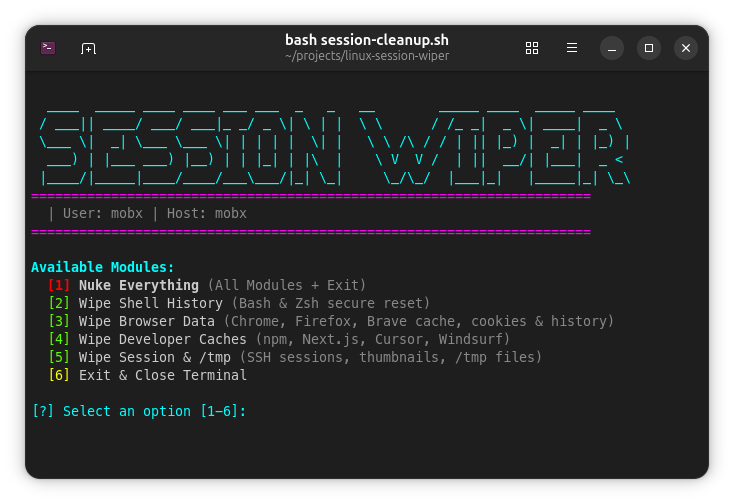

# Secure Session Cleanup Utility



A secure, user-space session cleanup utility designed for Debian/Ubuntu development environments. This script helps you quickly and safely close your workspace for privacy and maintenance reasons.

When executed, the `session-cleanup.sh` script will:
1. Clear the terminal screen and display a stylized aesthetic exit message.
2. Clear the active bash/zsh history for your user to maintain session privacy.
3. Gracefully terminate any of your active SSH connections or background network jobs.
4. Clean up temporary cache folders (such as `~/.cache/thumbnails` and your specific files in `/tmp`) used in the current session.
5. Safely close the terminal window.

The script operates in user space during cleanup operations, with optional system-wide binary placement for convenience.

## Installation

### Quick Install (System-Wide)

To install the tool globally so it can be executed system-wide from any directory by simply typing `wiper`, run this command:

```bash
sudo curl -sL "https://raw.githubusercontent.com/mobx2/linux-session-wiper/refs/heads/main/session-cleanup.sh" -o /usr/local/bin/wiper && sudo chmod +x /usr/local/bin/wiper
```

This command downloads the script directly into `/usr/local/bin/wiper` and grants executable permissions. You can then run the utility anytime with:

```bash
wiper
```

### Manual Installation

1. Clone this repository:
   ```bash
   git clone https://github.com/mobx2/linux-session-wiper.git
   cd linux-session-wiper
   ```
2. Make the script executable:
   ```bash
   chmod +x session-cleanup.sh
   ```
3. Execute directly:
   ```bash
   ./session-cleanup.sh
   ```

## Creating an Alias (`secure-exit`)

For quick access without system-wide installation, you can map the script to a shell alias.

Add the following line to your `~/.bashrc` or `~/.zshrc` configuration file:

```bash
# Secure exit alias
alias secure-exit='history -c && /absolute/path/to/session-cleanup.sh'
```

*Note: Replace `/absolute/path/to/session-cleanup.sh` with the actual absolute path to where you saved the script.*

After adding the alias, reload your shell configuration:

```bash
source ~/.bashrc
# or `source ~/.zshrc` if using zsh
```

## Usage

Simply type `wiper` (or `secure-exit` if using an alias) in your terminal to trigger the cleanup and safely close your session window.
